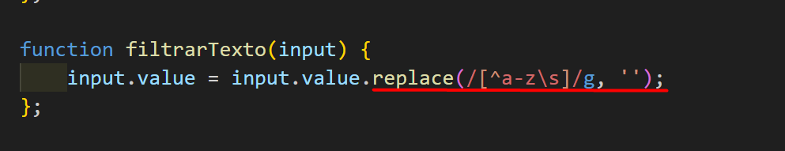
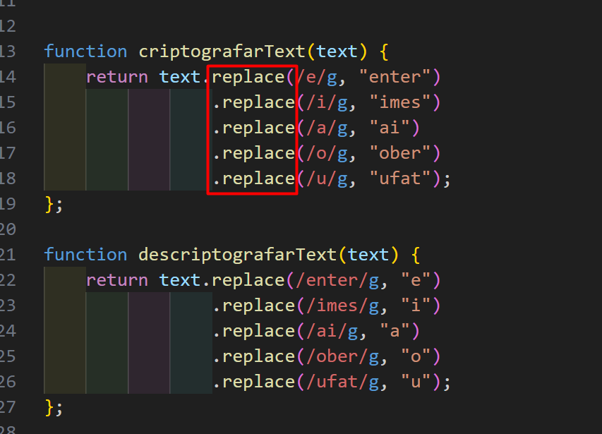

# CriptoMensagens

O `CriptoMensagens` é uma aplicação que codifica e descodificar mensagens. Projeto do challenge do programa ONE, da Oracle em parceira com Alura, para testar as minhas habilidades em HTML, CSS, JavaScript e Lógica de Progamação.

A aplicação apenas usa letras minúsculas para o processo. Adicionei função para evitar que caracteres especiasais, acentuação e letras maiúsculas não seja utilizadas. Para isso usei o método `.replace()` que é tanto usado para a codificação quanto para a descodificação de caraceter(s).

Também usei o mesmo método para realizar a tranformação dos caracteres para codificar/descodificar.

## Tecnologias utilizadas:

- HTML;
- CSS;
- JavaScript (JS);

 

<small>Para visitar o <i>site</i> (live) clique no gif.</small>
