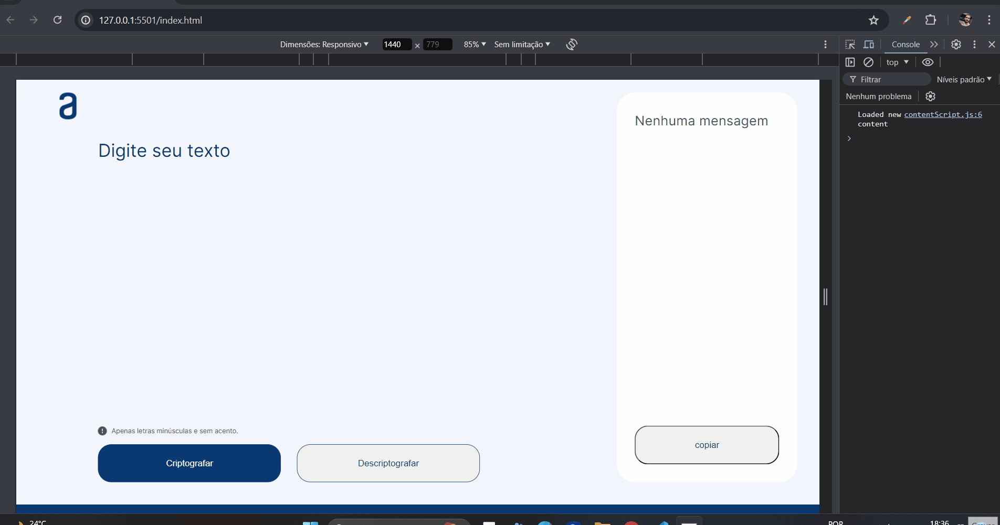

# Decodificador de Texto

Projeto que codifica e descodificar mensagens. Projeto do challenge do programa ONE para testar as minhas habilidades em HTML, CSS, JavaScript e Lógica de Progamação.

## Tecnologias utilizadas:

- HTML;
- CSS;
- JavaScript (JS);

  

